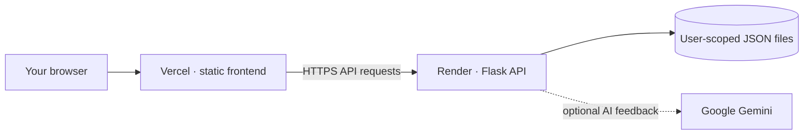

<div align="center">
  
  <h1>CareerOS</h1>
  <p><strong>Turn career goals into a clear next move.</strong></p>
  <p>A focused workspace for career planning, resume insights, skill growth and interview practice.</p>
  <p>
    <a href="https://ai-career-intelligence-platform-fro.vercel.app"><strong>Open CareerOS</strong></a>
    &nbsp;·&nbsp;
    <a href="https://ai-career-intelligence-platform-dhyb.onrender.com/api/health">API status</a>
  </p>
</div>

---

## The idea

CareerOS brings the next steps of a job search into one calm, connected workspace. Save your goals once, turn them into a practical roadmap, and keep your learning, applications and interview practice moving forward.

**Set a direction → Build useful skills → Show your work → Track progress**

## What you can do

| Plan | Prepare | Keep moving |
| --- | --- | --- |
| Create a 30-day career roadmap | Review a resume with a transparent ATS estimate | Track applications and interviews |
| Compare current skills with a target role | Analyze a job description and practice interviews | See milestones and recent career activity |
| Get project ideas based on your profile | Use optional Gemini feedback for AI-assisted guidance | Reuse saved career context across tools |

## How it fits together



**Stack:** HTML, CSS and vanilla JavaScript · Python and Flask · Render · Vercel · optional Gemini API

## Live deployment

- **Frontend:** [ai-career-intelligence-platform-fro.vercel.app](https://ai-career-intelligence-platform-fro.vercel.app)
- **Backend health:** [Render API status](https://ai-career-intelligence-platform-dhyb.onrender.com/api/health)
- **Frontend project root:** `frontend/` (Vercel, preset **Other**, no build step)
- **Backend project root:** `backend/` (Render, `gunicorn app:app`)

### Data persistence

The API currently stores account and career records in user-scoped JSON files. Resume files are parsed in memory and are not retained. The current Render Free service has ephemeral storage, so saved JSON data is **not guaranteed to survive a service restart or redeploy**. The repository’s Render Blueprint includes a persistent disk, which requires a compatible paid Render service.

## Run locally

Use Python 3.10 or newer. Start the API in one PowerShell window:

```powershell
cd backend
py -m venv .venv
.venv\Scripts\Activate.ps1
pip install -r requirements.txt
Copy-Item .env.example .env
py app.py
```

Set a unique `SECRET_KEY` in `backend/.env`. To enable Gemini responses, add your own `GEMINI_API_KEY` there. Keep `.env` private and never commit it.

Serve the frontend from a second PowerShell window:

```powershell
cd frontend
py -m http.server 5500
```

Open `http://127.0.0.1:5500`. The frontend defaults to the deployed API. To use your local API for this browser, open its developer console and run:

```js
localStorage.setItem('career_api_url', 'http://127.0.0.1:5000/api');
```

Reload the page. To return to the deployed API later, run `localStorage.removeItem('career_api_url')` and reload.

## Configuration

| Variable | Required | Purpose |
| --- | :---: | --- |
| `SECRET_KEY` | Yes | Signs secure Flask sessions; use a long, random value |
| `FRONTEND_URL` | Yes in deployment | Exact frontend origin allowed by CORS, with no trailing slash |
| `GEMINI_API_KEY` | No | Enables Gemini-assisted guidance and feedback |
| `GEMINI_MODEL` | No | Primary Gemini model |
| `GEMINI_FALLBACK_MODELS` | No | Models tried if the primary model is unavailable |
| `SMTP_HOST`, `SMTP_PORT`, `SMTP_USERNAME`, `SMTP_PASSWORD`, `SMTP_FROM` | No | Sends password-reset email |
| `DATA_DIR` | No | JSON storage location; defaults to `backend/data` |

See [`backend/.env.example`](backend/.env.example) for local values. Set production secrets in Render’s environment settings, never in frontend code.

## API at a glance

All routes use the `/api` prefix. Authenticated requests use secure HTTP-only session cookies.

| Area | Routes |
| --- | --- |
| Health and accounts | `GET /health`, `/auth/register`, `/auth/login`, `/auth/logout` |
| Career profile and roadmap | `/profile`, `/career/plan`, `/skills/analyze`, `/skills/gaps` |
| Resume and job preparation | `/resume/analyze`, `/resume/history`, `/jobs/match`, `/jobs/analyze-description` |
| Practice and projects | `/interview/start`, `/interview/answer`, `/projects/recommend`, `/assistant/message` |
| Applications and progress | `/applications`, `/progress` |

## Privacy and scoring

- Passwords are hashed; reset tokens are one-use and expire after 30 minutes.
- Resume uploads are validated, parsed in memory and not stored as files.
- ATS estimates come from a reproducible Python heuristic. Gemini can explain feedback but does not determine the numeric score.
- Job suggestions are directions to explore, not live vacancy claims. Resume scores are estimates, not guarantees of hiring outcomes.
- CORS is restricted to the configured frontend origin, and authenticated write requests use CSRF protection.

## Repository map

```text
frontend/       Static pages, styles and browser-side API client
backend/
  app.py        Flask application and security configuration
  routes/       API endpoints
  services/     Resume analysis, career planning and optional Gemini
  utils/        JSON persistence, validation, authentication and parsing
  data/         Local JSON records (created at runtime; not committed)
render.yaml     Render Blueprint configuration
```

---

<div align="center">
  <sub>Built to make career progress feel practical, visible and yours.</sub>
</div>
